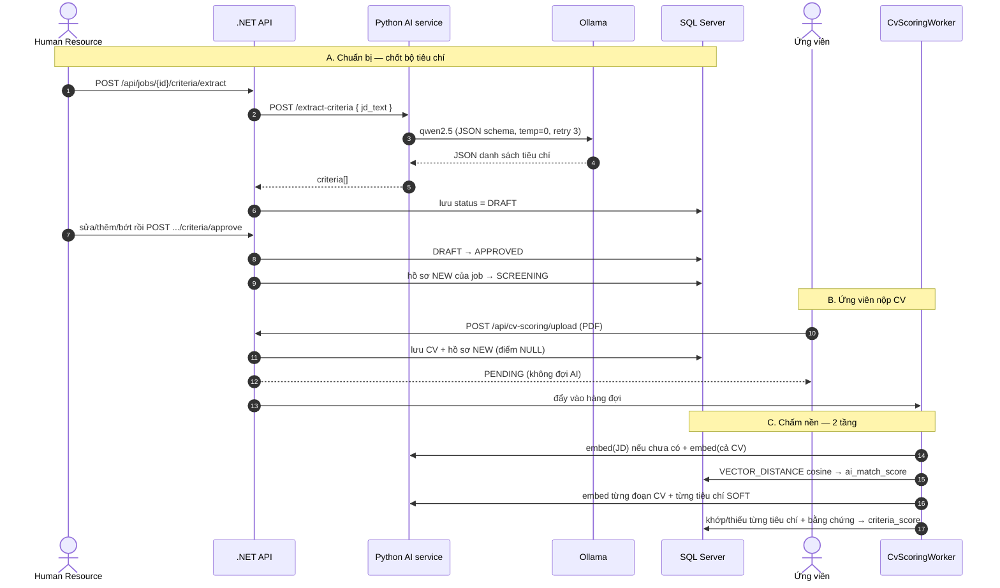

# AI Bóc tiêu chí & Sàng lọc CV — Tài liệu kỹ thuật

> ⚠️ **08/08/2026 — PHẦN SÀNG LỌC/CHẤM CV ĐÃ BỊ LOẠI KHỎI HỆ THỐNG.**
> Còn đúng và còn chạy: luồng *bóc tiêu chí từ JD → người duyệt chốt*.
> Mọi mô tả về chunk CV, cosine per-criterion, điểm, xếp hạng, Talent Pool dưới đây
> là HỒ SƠ THIẾT KẾ CŨ (giữ cho báo cáo), không phải code hiện tại.

> Dành cho người làm Backend cần đọc/sửa phần này. Đọc hết mất ~15 phút.
> Nghiệp vụ nền: `docs/00_CONTEXT.md` §5.18. Danh sách endpoint: `docs/API_ENDPOINTS.md`.

## 0. Tóm tắt 30 giây

Hai luồng nối tiếp nhau:

1. **Bóc tiêu chí** — LLM cục bộ đọc JD → sinh danh sách tiêu chí **DRAFT** → người duyệt chốt thành **APPROVED**.
2. **Sàng lọc CV** — ứng viên nộp CV → chấm **hai tầng** ở tiến trình nền → ra bảng khớp/thiếu kèm câu bằng chứng.

Ba nguyên tắc bất di bất dịch của phần này:

- **AI không quyết tiêu chí** — đầu ra của LLM luôn là DRAFT, phải có người duyệt.
- **Hệ thống không tự loại ai** — tiêu chí trượt chỉ kéo điểm xuống, người sàng lọc quyết.
- **Mọi kết luận phải kèm bằng chứng** — luôn trả về đoạn text trong CV để người đọc kiểm chứng.

---

## 1. Bức tranh tổng thể



---

## 2. Luồng A — Bóc tiêu chí từ JD

### 2.1 Phía Python (`ai-service/criteria_extract.py`)

Stateless hoàn toàn: **không đụng DB, không biết tenant**. Nhận `jd_text`, trả danh sách tiêu chí.

Cách ép LLM ra dữ liệu dùng được:

| Kỹ thuật | Chi tiết |
|---|---|
| Schema cứng | Pydantic `Criterion` — `name` (2–150 ký tự), `type` (`HARD`\|`SOFT`), `cv_matchable`, `keywords[]`, `weight` (0.1–5). Danh sách 1–20 tiêu chí |
| Ép định dạng | Gọi Ollama với `format = json_schema`, `temperature = 0` |
| Validate + retry | Parse không hợp lệ → thử lại, tối đa **3 lượt** |
| Hết lượt | Ném exception → API trả **HTTP 502** → .NET cho người nhập tay |

Prompt có few-shot đa ngành (kế toán, lái xe, tiếng Anh, SQL…) và các luật quan trọng:

- Chỉ bóc thứ **có thật trong văn bản**, cấm bịa.
- Bỏ phần giới thiệu công ty / phúc lợi / lương — không phải tiêu chí.
- `HARD` = yêu cầu cứng loại trừ (bằng cấp, chứng chỉ, số năm tối thiểu, địa điểm, công nghệ bắt buộc). `SOFT` = kỹ năng, năng lực.
- `cv_matchable = false` cho thứ CV không thể hiện được (thái độ, văn hóa) → **chấm CV bỏ qua nhóm này để không loại oan**.
- `keywords` bắt buộc cho mọi tiêu chí HARD, phải song ngữ và đủ đặc trưng ("tiếng Anh" + "English" + "IELTS"), cấm dùng từ đơn chung chung như "API".

### 2.2 Phía .NET (`EvaluationCriteriaService.cs`)

| Bước | Method | Ghi chú |
|---|---|---|
| Bóc | `ExtractDraftAsync` (`:86`) | Xóa DRAFT cũ của job trước khi ghi lứa mới → gọi lại nhiều lần vô hại. `Source = AI_EXTRACTED`, `Status = DRAFT` |
| Duyệt | `ApproveDraftsAsync` (`:137`) | DRAFT → APPROVED. **Kèm tác dụng phụ:** đẩy mọi hồ sơ đang `NEW` của job sang `SCREENING` (`AdvanceNewApplicationsToScreeningAsync`) để người dùng không phải kéo tay từng thẻ trên Kanban |
| Nhập tay | `CreateAsync` (`:36`) | `Source = MANUAL`, `Status = APPROVED` luôn — người gõ thì khỏi cần duyệt |

**Chỉ tiêu chí `APPROVED` mới được dùng để chấm.** DRAFT nằm đó chờ duyệt, không ảnh hưởng điểm.

### 2.3 Bảng `EvaluationCriteria` — các cột đáng nhớ

| Cột | Ý nghĩa |
|---|---|
| `criteria_type` | `HARD` (lọc rule/keyword) hay `SOFT` (so vector) |
| `cv_matchable` | `false` → chấm CV **bỏ qua**, chỉ dùng khi phỏng vấn |
| `status` | `DRAFT` / `APPROVED` |
| `source` | `AI_EXTRACTED` / `MANUAL` |
| `keywords` | Chuỗi phân tách bằng `;`. NULL → dùng `name` |
| `weight` | Trọng số khi tính điểm tổng |
| `embedding` | `VECTOR(1024)`, chỉ tiêu chí SOFT mới cần, embed lười (lazy) |

---

## 3. Luồng B — Sàng lọc CV

### 3.1 Pha đồng bộ — trong request nộp CV (`CvScoringService.ScoreUploadedCvAsync` `:41`)

```
upsert ứng viên theo email
   └─► lưu file gốc lên MinIO      (lỗi storage KHÔNG chặn chấm, chỉ mất link file)
        └─► bóc text từ PDF
             ├─ file hỏng            → CvDocument.parse_status = FAILED, trả lý do
             ├─ PDF scan ảnh (không có lớp text) → NEEDS_MANUAL_EDIT, KHÔNG chấm
             └─ đọc được text
                  └─► kiểm job tồn tại + có JD   (chưa gọi AI — fail sớm)
                       └─► lưu CvDocument (embedding NULL) + Application (NEW, điểm NULL)
                            └─► Enqueue(companyId, applicationId)
                                 └─► trả PENDING ngay
```

Ứng viên **không phải chờ AI**. Toàn bộ phần nặng đẩy sang worker.

### 3.2 Worker nền (`Workers/CvScoringWorker.cs`)

- **Một luồng, đọc tuần tự** — cố ý, để không dội request đồng thời vào AI service.
- Lúc khởi động chạy `SweepUnscoredAsync`: quét mọi hồ sơ chưa có điểm và vớt lại (phòng trường hợp server restart giữa chừng).
- Mỗi hồ sơ: tạo DI scope mới → **gán `IContextData.CompanyId` TRƯỚC khi resolve service/DbContext**.

> ⚠️ **Bẫy chết người:** scope nền không có HTTP request nên không ai set tenant. Quên gán `CompanyId` là `SESSION_CONTEXT` rỗng → RLS chặn sạch (hoặc tệ hơn, đọc nhầm tenant). Sửa code trong worker thì luôn kiểm tra dòng này.

- Lỗi một hồ sơ (AI service chết chẳng hạn) chỉ log rồi đi tiếp — điểm để NULL, lần khởi động sau sweep vớt lại.

### 3.3 Tầng 1 — cả CV ↔ cả JD (`ScoreApplicationAsync` `:245`)

1. Embed JD nếu job chưa có vector (**lazy, một lần cho mỗi job**).
2. Embed toàn bộ text CV → ghi vào `CvDocument.embedding`.
3. `VECTOR_DISTANCE('cosine', ...)` chạy **trong SQL Server** (cột vector bị `Ignore` ở EF nên đi raw SQL).
4. `score = (1 − distance) × 100`, clamp 0–100 → `Application.ai_match_score`.

Đây là **điểm đang dùng để xếp hạng** trên UI. Xem mục 7 để biết vì sao đó là chỗ cần cải tiến.

### 3.4 Tầng 2 — theo từng tiêu chí (`CriteriaScoringService.ScoreByCriteriaAsync` `:48`)

Gọi ngay sau tầng 1, dạng **best-effort**: lỗi ở đây không được phá điểm tầng 1 vừa lưu.

**Bước 1 — lấy tiêu chí.** `APPROVED` + `active` + `cv_matchable = true`. Không có tiêu chí nào → thoát êm.

**Bước 2 — chunk + embed CV** (`EnsureCvChunksAsync` `:160`, chạy một lần cho mỗi CV):

`CvChunker.Split` tách theo dòng trống, gộp đoạn < 120 ký tự, cắt đoạn > 700 ký tự theo ranh giới từ → embed từng đoạn → lưu bảng `CvChunk`.

**Bước 3 — embed tiêu chí SOFT** (lazy, chỉ embed `name`).

**Bước 4 — đối chiếu từng tiêu chí:**

| Loại tiêu chí | Cách chấm | Bằng chứng trả về |
|---|---|---|
| **HARD — dạng "≥ N năm kinh nghiệm"** | `ExperienceYearsMatcher`: đọc N từ tên tiêu chí, quét mốc thời gian trong CV, gộp khoảng chồng lấn, so số | *"Ước tính 4 năm kinh nghiệm (yêu cầu từ 3 năm). Mốc thời gian trong CV: 01/2021 - 01/2025"* |
| **HARD — còn lại** | Tìm keyword trong text CV, so cả bản **bỏ dấu** (`kế toán` ↔ `ke toan`) | Cửa sổ ±120 ký tự quanh vị trí tìm thấy, cắt trên text **gốc** (giữ dấu) |
| **SOFT** | SQL tìm **đoạn CV gần nhất** cho tiêu chí → `similarity = 1 − distance` → khớp nếu `≥ ngưỡng` | Đoạn gần nhất — **kể cả khi trượt**, để người đọc thấy "CV nói gần nhất là gì" |

**Bước 5 — tính điểm:**

```
criteria_score = Σ weight(tiêu chí khớp) / Σ weight(tất cả tiêu chí) × 100
```

Ghi vào `ApplicationCriterionMatch` (thay toàn bộ dòng cũ) + `Application.criteria_score`.

> Tiêu chí HARD trượt **chỉ kéo điểm xuống và hiện cờ đỏ** — code cố ý không auto-reject.

---

## 4. Bản đồ code

| File | Trách nhiệm |
|---|---|
| `ai-service/main.py` | `/health`, `/embed` (bge-m3 qua Ollama) |
| `ai-service/criteria_extract.py` | `/extract-criteria` (qwen2.5): schema + prompt + retry |
| `Lib/Services/Ai/EmbeddingClient.cs` | HTTP client gọi `/embed` |
| `Lib/Services/Ai/CriteriaExtractionClient.cs` | HTTP client gọi `/extract-criteria` |
| `Lib/Services/Ai/PdfTextExtractor.cs` | PDF → text, phân loại đọc được / scan ảnh |
| `Application/Services/Ai/CvScoringService.cs` | Nhận CV, lưu, xếp hàng đợi; tầng 1 |
| `Application/Services/Ai/CriteriaScoringService.cs` | Tầng 2 — chấm theo tiêu chí |
| `Application/Services/Ai/CvChunker.cs` | Cắt CV thành đoạn |
| `Application/Services/Ai/ExperienceYearsMatcher.cs` | Đọc "N năm" từ tiêu chí + tính số năm từ CV |
| `Application/Services/Ai/TalentPoolService.cs` | Quét ngược kho CV cũ (**dùng chung** vector cả-CV của tầng 1) |
| `Application/Services/Business/EvaluationCriteriaService.cs` | Bóc / duyệt / CRUD tiêu chí |
| `Hosts/GP35.SRIS/Workers/CvScoringWorker.cs` | Hàng đợi + sweep khởi động + gán tenant |

**Bảng dữ liệu** (migration `V013__criteria_scoring.sql`): `EvaluationCriteria` (mở rộng) · `CvChunk` · `ApplicationCriterionMatch` · `Application.criteria_score`.

---

## 5. Endpoint

| Method | Path | Vai | Việc |
|---|---|---|---|
| POST | `/api/jobs/{jobId}/criteria/extract` | Human Resource | Bóc tiêu chí DRAFT từ JD |
| GET | `/api/jobs/{jobId}/criteria` | Human Resource | Danh sách tiêu chí của job |
| POST | `/api/jobs/{jobId}/criteria` | Human Resource | Thêm tiêu chí tay (APPROVED luôn) |
| PUT | `/api/evaluation-criteria/{criteriaId}` | Human Resource | Sửa tiêu chí |
| DELETE | `/api/evaluation-criteria/{criteriaId}` | Human Resource | Ngừng dùng (soft) |
| POST | `/api/jobs/{jobId}/criteria/approve` | Human Resource | Chốt DRAFT → APPROVED (+ đẩy hồ sơ NEW sang SCREENING) |
| POST | `/api/cv-scoring/upload` | — | Nộp CV |
| GET | `/api/cv-scoring/jobs/{jobId}/ranking` | Human Resource | Xếp hạng ứng viên |
| GET | `/api/applications/{id}/criteria-matches` | Human Resource | Bảng khớp/thiếu + bằng chứng |
| POST | `/api/applications/{id}/criteria-score` | Human Resource | **Chấm lại** một hồ sơ theo bộ tiêu chí hiện tại |

---

## 6. Cấu hình & chạy thử

```jsonc
"AiService": {
  "BaseUrl": "http://127.0.0.1:8000",
  "CriteriaMatchThreshold": 0.5   // ngưỡng khớp của tiêu chí SOFT (mặc định trong code là 0.6)
}
```

Biến môi trường phía Python: `SRIS_EMBED_MODEL` (mặc định `bge-m3`), `SRIS_LLM_MODEL` (mặc định `qwen2.5`).

**Chạy thử tay:**

```powershell
# 1. Dịch vụ nền
ollama pull bge-m3; ollama pull qwen2.5
cd ai-service; .\run_ai.ps1          # :8000
cd tools; .\run_minio.ps1            # :9000
```

Rồi trên Swagger sau khi Authorize:

1. Tạo job có JD đầy đủ → `POST /api/jobs`
2. `POST /api/jobs/{id}/criteria/extract` → xem danh sách DRAFT
3. Sửa lại cho hợp lý → `POST /api/jobs/{id}/criteria/approve`
4. Nộp CV qua career site công khai
5. Đợi vài giây (worker chạy nền) → `GET /api/applications/{id}/criteria-matches`

Muốn có sẵn dữ liệu đủ mọi trạng thái: `python tools/seed_demo.py <admin-email> <password>`.

---

## 7. Hạn chế đã biết — đọc kỹ trước khi sửa

Phần này ghi thẳng để không ai mất thời gian phát hiện lại.

1. **Ngưỡng similarity đã được đo là không đủ tin cậy.** Thí nghiệm ở `ai-experiments/exp_criteria_threshold/` cho thấy độ tương đồng của cặp đạt và không-đạt chồng lên nhau — độ chính xác tốt nhất **0,611** so với đoán ngẫu nhiên 0,500, trong khi để LLM phán đạt **0,972**. Hướng khắc phục đã chốt (**Việc B4c, chưa code**): sau khi vector truy hồi được đoạn CV thì thêm một bước LLM kiểm chứng. Trong lúc chưa làm, **đừng trình bày con số similarity như một phán quyết trên UI** — gọi nó là "độ liên quan".

2. **Xếp hạng đang dùng điểm tầng 1** (cosine cả-CV ↔ cả-JD) chứ không phải `criteria_score`. Đúng thông điệp sản phẩm thì nên xếp theo điểm tiêu chí khi job đã có tiêu chí.

3. **Việc cắt đoạn CV đang chạy mù.** `PdfTextExtractor` gộp mọi khoảng trắng kể cả xuống dòng (`Regex.Replace(text, @"\s+", " ")`), nên nhánh tách theo đoạn của `CvChunker` **không bao giờ chạy** — thực tế mọi CV đều bị cắt cứng theo độ dài. Hệ quả: một đoạn có thể vắt ngang hai mục khác nhau, câu bằng chứng đôi khi trông lạc đề. Sửa: giữ lại `\n` khi bóc PDF.

4. **Tiêu chí SOFT chỉ embed `name`**, không dùng `keywords`/`description` → vector của chữ "Kinh nghiệm" gần như không mang thông tin.

5. **Không bóc trường có cấu trúc từ CV.** Không có họ tên / SĐT / kỹ năng / học vấn dạng field — chỉ có text thô + vector. Tên và email ứng viên là do họ tự điền trong form.

6. **CV không ghi mốc thời gian** thì tiêu chí đếm năm bị tính là không khớp (cột `Matched` chỉ có true/false, không có trạng thái "chưa rõ"). Bằng chứng có ghi rõ là thiếu dữ liệu.

7. **Hồ sơ nộp trước khi tiêu chí được duyệt sẽ không có điểm tiêu chí** — lúc chấm chưa có tiêu chí nên tầng 2 thoát sớm, và bước duyệt tiêu chí chỉ đẩy trạng thái chứ không chấm lại. Phải gọi `POST /api/applications/{id}/criteria-score` cho từng hồ sơ.

---

## 8. Quy tắc khi sửa phần này

1. **Worker nền phải gán `CompanyId` trước khi resolve DbContext** — quên là rò dữ liệu xuyên tenant hoặc bị RLS chặn sạch.
2. **Không auto-reject.** Điểm thấp, HARD trượt → hiện cờ, người quyết. Đừng thêm luồng tự loại.
3. **Đừng xóa embedding cả-CV ở tầng 1** dù có bỏ nó khỏi UI — `TalentPoolService` đang dựa hẳn vào cột đó để quét ngược kho CV cũ.
4. **Lỗi AI không được làm hỏng nghiệp vụ.** Mọi lời gọi AI đều phải có nhánh hỏng: PDF không đọc được → luồng nhập tay; LLM chết → 502 để người nhập tiêu chí tay; embed lỗi → để điểm NULL cho sweep vớt lại.
5. **Đổi cách chấm thì phải đo lại.** Khung đo sẵn có ở `ai-experiments/` (bộ test cố định, mỗi lần đổi một yếu tố, đo hai tầng máy + người). Đừng đổi ngưỡng hay đổi model rồi kể là "tốt hơn" khi chưa có số.
6. **Sửa endpoint thì cập nhật `docs/API_ENDPOINTS.md` trong cùng commit.**
