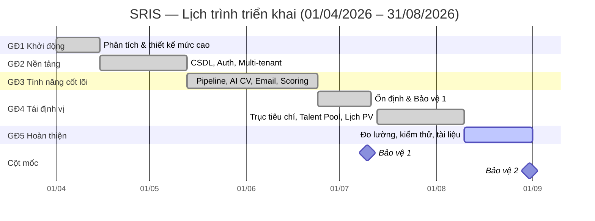

**ĐỒ ÁN TỐT NGHIỆP**

──────────────────

**WORK BREAKDOWN STRUCTURE (WBS)**

_Cấu trúc phân rã công việc & Kế hoạch triển khai_

Tên đề tài:

**Xây dựng Hệ thống tuyển dụng và phỏng vấn thông minh**

_cho Doanh nghiệp (Smart Recruitment and Interview System — SRIS)_

| | |
| -------------- | ------------------------------------------------ |
| **Sản phẩm:**  | Smart Recruitment and Interview System (SRIS) |
| **Mô hình:**   | SaaS Multi-tenant ATS tích hợp AI cục bộ |
| **Nhóm:**      | GP35 — 5 thành viên (3 Backend .NET · 2 Frontend React) |
| **Thời gian:** | 5 tháng (01/04/2026 – 31/08/2026), 10 sprint × 2 tuần |
| **Phiên bản:** | v1.0 — 04/08/2026 |
| **Tài liệu liên quan:** | `SRIS_Business_Overview.md` · `Development/backend/docs/00_CONTEXT.md` |

# Mục lục

**1\.** Mục đích & phạm vi tài liệu

**2\.** Nhóm dự án & phân vai

**3\.** Cấu trúc phân rã công việc (WBS)

**4\.** Bảng công việc chi tiết theo giai đoạn

**5\.** Tổng hợp khối lượng công việc

**6\.** Lịch trình & cột mốc

**7\.** Ma trận trách nhiệm (RACI)

**8\.** Quy ước quản lý tiến độ & Definition of Done

**9\.** Quản lý thay đổi phạm vi

# 1\. Mục đích & phạm vi tài liệu

Tài liệu này phân rã toàn bộ khối lượng công việc của đồ án SRIS thành các gói công việc
(work package) có thể giao được, ước lượng được và nghiệm thu được.

Mỗi dòng công việc gồm: **mã WBS · nội dung · người phụ trách · ước lượng (giờ) · sprint ·
trạng thái · minh chứng** (tệp mã nguồn, script migration hoặc tài liệu tương ứng trong repo).
Cột minh chứng cho phép đối chiếu ngược từ kế hoạch sang sản phẩm thực tế — mọi công việc
đánh dấu hoàn thành đều có hiện vật kiểm chứng được trong mã nguồn.

**Đơn vị ước lượng:** giờ công (person-hour). Năng lực quy ước: 16 giờ/người/tuần
(đồ án song song với lịch học), tương đương 32 giờ/người/sprint.

# 2\. Nhóm dự án & phân vai

| **Mã** | **Thành viên** | **Vai trò** | **Phạm vi phụ trách chính** |
| --- | --- | --- | --- |
| **BE1** | Vũ Gia Khánh | BA/PM kiêm Backend Lead | Kiến trúc hệ thống, Auth & phân quyền, State Machine, AI service (embedding + bóc tiêu chí), phương pháp đánh giá AI, tài liệu |
| **BE2** | San | Backend — Nền tảng dữ liệu & Hạ tầng | Thiết kế CSDL, migration, Multi-tenant/RLS, lưu trữ tệp (MinIO), xử lý PDF & vector, đặt lịch phỏng vấn, triển khai |
| **BE3** | Huy Minh | Backend — Nghiệp vụ & Tích hợp | Job/Yêu cầu tuyển dụng, quản lý người dùng & phòng ban, Email automation, Dashboard & Analytics, dữ liệu demo |
| **FE1** | Tùng Anh | Frontend — Candidate Portal & Phỏng vấn | Career Site, form nộp CV, các trang magic link (chọn lịch, trạng thái, trả lời offer), phiếu chấm phỏng vấn |
| **FE2** | Hùng Anh | Frontend — Employer Portal & Trực quan hóa | Kanban, quản lý tin tuyển dụng, duyệt tiêu chí, Dashboard biểu đồ, brand theming, hệ thống giao diện chung |

**Nguyên tắc phân công:** mỗi gói công việc có **đúng một người chịu trách nhiệm chính**;
công việc liên tầng (FE–BE) được tách thành hai gói riêng để tránh chồng lấn trách nhiệm.
Khối lượng được cân bằng giữa 5 thành viên (chênh lệch < 5% — xem Mục 5).

# 3\. Cấu trúc phân rã công việc (WBS)

```
SRIS — Đồ án tốt nghiệp
├── 1. Khởi động & Phân tích
│   ├── 1.1 Nghiên cứu bối cảnh & yêu cầu
│   ├── 1.2 Thiết kế hệ thống mức cao
│   └── 1.3 Thiết lập môi trường & khung dự án
├── 2. Nền tảng hệ thống
│   ├── 2.1 Cơ sở dữ liệu & Migration
│   ├── 2.2 Xác thực & Phân quyền (M8)
│   ├── 2.3 Đa thuê bao & Cô lập dữ liệu (M7)
│   ├── 2.4 Quản lý tin tuyển dụng & Career Site (M1)
│   └── 2.5 Khung giao diện & Pipeline cơ bản (M2)
├── 3. Tính năng cốt lõi
│   ├── 3.1 State Machine & Pipeline đầy đủ (M2)
│   ├── 3.2 AI Service & Chấm điểm CV (M3)
│   ├── 3.3 Email Automation (M4)
│   ├── 3.4 Collaborative Scoring (M5)
│   ├── 3.5 Dashboard & Analytics (M6)
│   └── 3.6 Offer & Magic link ứng viên
├── 4. Tái định vị hậu hội đồng
│   ├── 4.1 Xử lý phản hồi hội đồng & thu hẹp phạm vi
│   ├── 4.2 Trục tiêu chí: bóc — duyệt — chấm CV theo tiêu chí
│   ├── 4.3 Yêu cầu tuyển dụng & Phòng ban
│   ├── 4.4 Talent Pool (tính năng đinh)
│   └── 4.5 Đặt lịch phỏng vấn theo pool khung giờ (M9)
└── 5. Hoàn thiện, Đo lường & Bảo vệ
    ├── 5.1 Minh chứng sơ cấp (phỏng vấn doanh nghiệp)
    ├── 5.2 Đánh giá AI & hiệu chỉnh theo kết quả đo
    ├── 5.3 Kiểm thử & Chất lượng
    ├── 5.4 Triển khai & Vận hành
    └── 5.5 Tài liệu & Bảo vệ
```

**Chú thích trạng thái:** ✅ Hoàn thành · 🔄 Đang làm · ⬜ Chưa làm

# 4\. Bảng công việc chi tiết theo giai đoạn

## 4.1 Giai đoạn 1 — Khởi động & Phân tích (Sprint 1)

| **Mã** | **Công việc** | **PT** | **Giờ** | **Sprint** | **TT** | **Minh chứng** |
| --- | --- | --- | --- | --- | --- | --- |
| 1.1.1 | Desk research thị trường ATS + số liệu bối cảnh có nguồn | BE1 | 8 | S1 | ✅ | `docs/00_CONTEXT.md` §4.1 |
| 1.1.2 | Xây dựng persona + xác định nỗi đau nghiệp vụ | BE1 | 8 | S1 | ✅ | `SRIS_Business_Overview.md` §3 |
| 1.1.3 | Viết SRS + đặc tả yêu cầu chức năng/phi chức năng | BE1 | 12 | S1 | ✅ | Hồ sơ SRS |
| 1.2.1 | Thiết kế ERD v1 (SQL Server) | BE2 | 12 | S1 | ✅ | `V001__schema.sql` |
| 1.2.2 | Use Case diagram + đặc tả use case theo 4 vai | BE3 | 10 | S1 | ✅ | `docs/features/*.puml` |
| 1.2.3 | Wireframe Candidate Portal | FE1 | 12 | S1 | ✅ | Hồ sơ thiết kế UI |
| 1.2.4 | Wireframe Employer Portal | FE2 | 12 | S1 | ✅ | Hồ sơ thiết kế UI |
| 1.3.1 | Chốt stack + dựng khung solution theo Clean Layering | BE2 | 10 | S1 | ✅ | `GP35.SRIS.sln`, `Src/` |
| 1.3.2 | Thiết lập repo, quy ước nhánh/commit, quy ước mã nguồn | BE3 | 6 | S1 | ✅ | `CLAUDE.md`, lịch sử Git |
| 1.3.3 | Dựng dự án React + Vite + AntD + Tailwind, khung định tuyến | FE1 | 10 | S1 | ✅ | `vite.config.ts`, `src/App.jsx` |
| 1.3.4 | Hệ thống giao diện chung: layout, theme token, component dùng lại | FE2 | 10 | S1 | ✅ | `src/layouts`, `src/components` |

## 4.2 Giai đoạn 2 — Nền tảng hệ thống (Sprint 2–3)

| **Mã** | **Công việc** | **PT** | **Giờ** | **Sprint** | **TT** | **Minh chứng** |
| --- | --- | --- | --- | --- | --- | --- |
| 2.1.1 | Schema lõi: bảng nghiệp vụ, khóa, index, chính sách RLS | BE2 | 16 | S2 | ✅ | `V001__schema.sql` |
| 2.1.2 | Bộ migration có version (DbUp) + quy ước đặt tên | BE2 | 8 | S2 | ✅ | `tools/GP35.SRIS.DbMigrator/` |
| 2.2.1 | JWT + AuthService + refresh token xoay vòng | BE1 | 12 | S2 | ✅ | `AuthService.cs`, `JwtService.cs` |
| 2.2.2 | RBAC: AuthMiddleware, `[WithRole]`, `[WithPermission]`, `IContextData` | BE1 | 12 | S2 | ✅ | `AuthMiddleware`, `PermissionConstants` |
| 2.3.1 | Cô lập tenant: `SESSION_CONTEXT('CompanyId')` mỗi request + Global Query Filter | BE1 | 10 | S2 | ✅ | `SrisDbContext`, `V001__schema.sql` |
| 2.2.3 | Đăng ký công ty + Admin đầu tiên, quên/đặt lại mật khẩu | BE3 | 12 | S3 | ✅ | `AccountController.cs` |
| 2.2.4 | Quản lý người dùng: tạo, gán vai, khóa/mở, đặt lại mật khẩu | BE3 | 10 | S3 | ✅ | `UserManageService.cs` |
| 2.2.5 | Màn Đăng nhập/Đăng ký/Quên–Đặt lại mật khẩu + ProtectedRoute | FE1 | 14 | S2 | ✅ | `src/pages/auth/*` |
| 2.5.1 | Layout portal + điều hướng theo vai | FE2 | 12 | S2 | ✅ | `AdminLayout.jsx`, `AuthLayout.jsx` |
| 2.2.6 | Màn quản trị tài khoản & phòng ban | FE2 | 14 | S3 | ✅ | `src/pages/admin/*` |
| 2.4.1 | CRUD Job + JobService + phân trang/lọc/tìm kiếm | BE3 | 12 | S3 | ✅ | `JobService.cs`, `JobsController.cs` |
| 2.4.2 | Career Site công khai + middleware phân giải tenant theo slug | BE2 | 12 | S3 | ✅ | `CareerSiteService.cs`, `PublicCareerController.cs` |
| 2.4.3 | Lưu trữ tệp: abstraction Storage + MinIO + presigned URL | BE2 | 12 | S3 | ✅ | `GP35.SRIS.Storage.Minio` |
| 2.4.4 | Form nộp CV one-page (công khai) + kiểm tra dữ liệu | FE1 | 12 | S3 | ✅ | `src/pages/recruitment/*` |
| 2.4.5 | Màn quản lý tin tuyển dụng + tạo/sửa job | FE2 | 14 | S3 | ✅ | `JobManagement.jsx`, `CreateJob.jsx` |
| 2.5.2 | Thực thể Application + API danh sách theo pha (Kanban) | BE3 | 10 | S3 | ✅ | `ApplicationQueryService.cs` |
| 2.5.3 | Kanban kéo–thả | FE2 | 14 | S3 | ✅ | `recruiter/Dashboard.jsx` |
| 2.5.4 | Trang chi tiết ứng viên | FE1 | 12 | S3 | ✅ | `recruiter/CandidateDetail.jsx` |

## 4.3 Giai đoạn 3 — Tính năng cốt lõi (Sprint 4–6)

| **Mã** | **Công việc** | **PT** | **Giờ** | **Sprint** | **TT** | **Minh chứng** |
| --- | --- | --- | --- | --- | --- | --- |
| 3.1.1 | State Machine 6 trạng thái / 8 chuyển tiếp + guard + unit test | BE1 | 14 | S4 | ✅ | `ApplicationStateMachineTests.cs`, `V004` |
| 3.1.2 | Activity Log + Internal Note | BE3 | 10 | S4 | ✅ | `ActivityLogService.cs`, `InternalNoteService.cs` |
| 3.1.3 | Hiển thị 4 pha + thẻ trạng thái + hộp thoại chuyển pha/loại hồ sơ | FE2 | 12 | S4 | ✅ | `ApplicationStateTag.jsx` |
| 3.2.1 | Dựng AI service (FastAPI): `/health`, `/embed` với `bge-m3` | BE1 | 12 | S4 | ✅ | `ai-service/main.py` |
| 3.2.2 | Bóc text từ CV PDF + chuẩn hóa tiếng Việt | BE2 | 12 | S4 | ✅ | `CvScoringService.cs` |
| 3.2.3 | Cột `VECTOR(1024)` + đọc/ghi vector qua raw SQL | BE2 | 10 | S5 | ✅ | `V011__embedding_dim_1024.sql` |
| 3.2.4 | Chấm CV bất đồng bộ: worker nền + quét lại hồ sơ chưa chấm khi khởi động | BE2 | 14 | S5 | ✅ | `Workers/CvScoringWorker.cs` |
| 3.2.5 | Màn xếp hạng CV theo job + xem điểm | FE2 | 12 | S5 | ✅ | `analytics/CVScoring.jsx` |
| 3.3.1 | Email service + SMTP riêng theo công ty + template động | BE3 | 14 | S5 | ✅ | `V017__company_smtp.sql`, `EmailTemplateService.cs` |
| 3.3.2 | Kích hoạt email theo State Machine (mời lịch, xác nhận, kết quả, offer) | BE3 | 10 | S5 | ✅ | `NotificationService.cs` |
| 3.3.3 | Màn quản lý mẫu email | FE1 | 12 | S5 | ✅ | `mail-templates/MailTemplates.jsx` |
| 3.4.1 | Phiếu chấm phỏng vấn + Blind Review tự bật khi > 1 người chấm | BE1 | 14 | S5 | ✅ | `InterviewScoringService.cs` |
| 3.4.2 | Tổng hợp panel: radar + độ lệch chuẩn → cờ "cần bàn" | BE3 | 10 | S6 | ✅ | `InterviewScoringController.cs` |
| 3.4.3 | Phiếu chấm trong buổi phỏng vấn: tự lưu nháp, nộp | FE1 | 16 | S6 | ✅ | `interviewer/ScoringSheetModal.jsx` |
| 3.4.4 | Màn interviewer: buổi sắp tới, chi tiết, lịch sử chấm | FE1 | 14 | S6 | ✅ | `src/pages/interviewer/*` |
| 3.5.1 | API Dashboard: phễu, time-to-hire, tỉ lệ nhận offer, lý do loại, nguồn | BE3 | 14 | S6 | ✅ | `DashboardService.cs` |
| 3.5.2 | Màn Dashboard & Analytics (biểu đồ) | FE2 | 16 | S6 | ✅ | `analytics/Analytics.jsx` |
| 2.3.2 | Brand theming: logo, màu chủ đạo, giới thiệu công ty + API cấu hình | BE2 | 10 | S6 | ✅ | `CompanyService.cs`, `V017` |
| 2.3.3 | Màn cấu hình thương hiệu + xem trước Career Site | FE2 | 10 | S6 | ✅ | `company/CompanyBranding.jsx` |
| 3.6.1 | OfferDetail (0..1/hồ sơ) + gửi offer + luồng phản hồi | BE2 | 12 | S6 | ✅ | `V005__offer.sql`, `OfferService.cs` |
| 3.6.2 | Màn quản lý offer + trang ứng viên trả lời offer | FE1 | 14 | S6 | ✅ | `offer/OfferManagement.jsx`, `CandidateResponse.jsx` |
| 3.6.3 | Magic link: sinh & hash SHA-256, TTL, đốt khi chốt, 3 mục đích | BE1 | 12 | S6 | ✅ | `MagicLinkService.cs`, `MagicLinkTokenCodecTests.cs` |
| 3.6.4 | Middleware phân giải tenant cho khách ẩn danh (tiền tố CompanyId) | BE1 | 10 | S6 | ✅ | `MagicLinkController.cs` |
| 3.6.5 | Trang tra cứu trạng thái ứng viên (magic link STATUS) | FE1 | 10 | S6 | ✅ | `candidate/CandidateStatus.jsx` |

## 4.4 Giai đoạn 4 — Tái định vị hậu hội đồng (Sprint 7–9)

> Sau Bảo vệ 1 (10/07/2026), nhóm nhận 4 phản hồi từ hội đồng, quy về 3 vấn đề gốc và
> chốt tái định vị: thu hẹp đối tượng, bỏ module Quiz, chuyển sang chấm CV **theo tiêu chí**,
> nâng Talent Pool thành tính năng đinh.

| **Mã** | **Công việc** | **PT** | **Giờ** | **Sprint** | **TT** | **Minh chứng** |
| --- | --- | --- | --- | --- | --- | --- |
| 4.1.1 | Chuẩn bị Bảo vệ 1: slide, kịch bản demo, dữ liệu trình diễn | BE1 | 10 | S7 | ✅ | Hồ sơ bảo vệ 1 |
| 4.1.2 | Tổng hợp phản hồi hội đồng → 3 vấn đề gốc → chốt tái định vị + cập nhật context | BE1 | 12 | S8 | ✅ | `docs/00_CONTEXT.md` §12 |
| 4.1.3 | Gỡ toàn bộ module Quiz khỏi mã nguồn + drop 6 bảng, siết CHECK còn 6 trạng thái/3 mục đích | BE2 | 12 | S8 | ✅ | `V012__drop_quiz.sql` |
| 4.1.4 | Gỡ giao diện Quiz và các luồng liên quan phía FE | FE1 | 8 | S8 | ✅ | Lịch sử Git (07/2026) |
| 4.2.1 | Thiết kế lại schema tiêu chí: EvaluationCriteria mở rộng, CvChunk, ApplicationCriterionMatch | BE2 | 12 | S8 | ✅ | `V013__criteria_scoring.sql` |
| 4.2.2 | Endpoint `/extract-criteria` (Ollama + qwen2.5): JSON schema, kiểm tra hợp lệ, thử lại | BE1 | 14 | S8 | ✅ | `ai-service/criteria_extract.py` |
| 4.2.3 | Luồng DRAFT → người duyệt chốt → APPROVED + API quản lý tiêu chí | BE3 | 12 | S8 | ✅ | `EvaluationCriteriaService.cs` |
| 4.2.4 | Chia chunk CV + embedding hai tầng (toàn văn & theo đoạn) | BE2 | 12 | S8 | ✅ | `CvChunkerTests.cs` |
| 4.2.5 | Đối chiếu theo từng tiêu chí: HARD bằng rule, SOFT bằng vector, trích câu bằng chứng, điểm trọng số | BE1 | 16 | S9 | ✅ | `CriteriaScoringService.cs`, `CriteriaHardMatchTests.cs` |
| 4.2.6 | Thư viện tiêu chí mẫu theo nhóm vị trí | BE3 | 10 | S9 | ✅ | `V010__criteria_template.sql` |
| 4.2.7 | Màn duyệt & chỉnh bộ tiêu chí | FE2 | 14 | S8 | ✅ | `criteria/Criteria.jsx` |
| 4.2.8 | Màn kết quả chấm CV theo tiêu chí: khớp/thiếu + câu bằng chứng | FE1 | 14 | S9 | ✅ | `analytics/CVScoring.jsx` |
| 4.3.1 | Yêu cầu tuyển dụng: DM tạo → Recruiter duyệt → chuyển thành tin tuyển dụng | BE3 | 14 | S9 | ✅ | `V019__recruitment_request.sql` |
| 4.3.2 | Phòng ban + gán DM cho job + API danh sách chọn người | BE3 | 10 | S9 | ✅ | `V022`, `V023`, `UserOptionsController.cs` |
| 4.3.3 | Màn Yêu cầu tuyển dụng (DM) + màn duyệt (Recruiter) | FE2 | 14 | S9 | ✅ | `src/pages/dept-manager/*` |
| 4.3.4 | Màn quyết định tuyển dụng của DM | FE1 | 12 | S9 | ✅ | `dept-manager/HiringDecision.jsx` |
| 4.4.1 | Talent Pool: truy hồi ngược kho CV cũ theo job mới, lọc theo thời gian, cô lập tenant | BE2 | 12 | S9 | ✅ | `TalentPoolService.cs` |
| 4.4.2 | Màn Talent Pool | FE2 | 10 | S9 | ✅ | `talent-pool/TalentPool.jsx` |
| 4.5.1 | Pool khung giờ dùng chung + panel interviewer cho từng khung | BE2 | 16 | S9 | ✅ | `V018`, `V019__interview_slot_panel.sql` |
| 4.5.2 | Mời hàng loạt + cơ chế ai chốt trước lấy trước + cờ vàng/đỏ khi hết khung + chốt lịch tay | BE3 | 14 | S9 | ✅ | `InterviewPoolService.cs` |
| 4.5.3 | Sinh tệp lịch `.ics` + email xác nhận | BE3 | 8 | S9 | ✅ | `CandidateScheduleService.cs` |
| 4.5.4 | Màn mở pool khung giờ + mời ứng viên (Recruiter) | FE2 | 14 | S9 | ✅ | `recruiter/InterviewScheduleRecruit.jsx` |
| 4.5.5 | Trang ứng viên tự chọn khung giờ (magic link SCHEDULE) | FE1 | 14 | S9 | ✅ | `candidate/Schedule.jsx` |

## 4.5 Giai đoạn 5 — Hoàn thiện, Đo lường & Bảo vệ (Sprint 9–10)

| **Mã** | **Công việc** | **PT** | **Giờ** | **Sprint** | **TT** | **Minh chứng** |
| --- | --- | --- | --- | --- | --- | --- |
| 5.1.1 | Phỏng vấn sâu doanh nghiệp ≤200 người — mỗi thành viên 1 công ty | BE1·BE2·BE3·FE1·FE2 | 30 | S9 | 🔄 | Bộ 23 câu / 6 phần + phiếu ghi |
| 5.1.2 | Tổng hợp phiếu ghi → bảng kết quả + điền KPI hiện trạng | BE1 | 8 | S10 | 🔄 | `docs/00_CONTEXT.md` §4.3 |
| 5.2.1 | Khung đánh giá AI: bộ test cố định, versioning prompt, đo hai tầng | BE1 | 10 | S9 | ✅ | `ai-experiments/README.md` |
| 5.2.2 | Thí nghiệm đo ngưỡng similarity: dataset, quét ngưỡng, đối chứng LLM | BE1 | 14 | S9 | ✅ | `exp_criteria_threshold/out/KET_QUA.md` |
| 5.2.3 | Bổ sung bước LLM kiểm chứng sau khi vector truy hồi đoạn CV | BE2 | 14 | S10 | ⬜ | Việc B4c |
| 5.2.4 | Đo cỡ chunk + chất lượng bóc tiêu chí trên CV thật (2 người gán nhãn) | BE3 | 12 | S10 | ⬜ | Việc B4d |
| 5.3.1 | Kiểm thử đơn vị backend: state machine, magic link, auth, chunker, đối chiếu HARD | BE2 | 12 | S10 | ✅ | `Tests/GP35.SRIS.Application.Tests/` |
| 5.3.2 | Kiểm thử frontend (Vitest) cho luồng ứng viên & tạo job | FE1 | 10 | S10 | 🔄 | `*.test.jsx` |
| 5.3.3 | Kiểm thử cô lập dữ liệu đa thuê bao (RLS) | BE2 | 10 | S10 | ⬜ | Backlog kỹ thuật |
| 5.3.4 | Rà soát đồng bộ giao diện: trạng thái tải, rỗng, lỗi trên toàn portal | FE2 | 10 | S10 | 🔄 | Toàn bộ `src/pages` |
| 5.3.5 | Sinh dữ liệu demo qua API thật (đi qua RLS, hàng đợi chấm điểm, magic link) | BE3 | 10 | S10 | ✅ | `tools/seed_demo.py` |
| 5.3.6 | Sửa lỗi tích hợp FE–BE: tiền tố `/api`, proxy, token, loại hồ sơ kèm lý do | FE2 | 12 | S10 | ✅ | `vite.config.ts`, `api.js` |
| 5.3.7 | Đối soát hợp đồng API FE–BE sau tích hợp | BE3 | 6 | S10 | ✅ | `docs/API_ENDPOINTS.md` |
| 5.3.8 | Hồ sơ cá nhân, ảnh đại diện, đổi mật khẩu, loại hình làm việc — API | BE3 | 10 | S10 | ✅ | `V014`, `V025`, `V027` |
| 5.3.9 | Màn Cài đặt tài khoản + trang chủ portal | FE1 | 10 | S10 | ✅ | `Settings.jsx`, `Home.jsx` |
| 5.3.10 | Trang chi tiết tin tuyển dụng công khai + giao diện Career Site theo thương hiệu | FE1 | 12 | S10 | ✅ | `PublicJobDetail.jsx`, `CareerChrome.jsx` |
| 5.3.11 | Chuyển build CRA → Vite, dọn cấu hình build & test | FE1 | 10 | S10 | ✅ | `vite.config.ts`, `package.json` |
| 5.3.12 | Tối ưu trải nghiệm theo phản hồi + rà soát hiển thị đa kích thước màn hình | FE2 | 14 | S10 | 🔄 | Toàn bộ `src/pages` |
| 5.3.13 | Chuẩn hóa xử lý lỗi phía FE: interceptor, hiển thị thông báo lỗi chuẩn từ backend | FE1 | 10 | S10 | ✅ | `src/services/api.js` |
| 5.3.14 | Màn quản lý loại hình làm việc + cấu hình dùng chung (Admin) | FE2 | 8 | S10 | ✅ | `admin/EmploymentTypeManagement.jsx` |
| 5.4.1 | Rà soát bảo mật: xoay khóa, đưa bí mật ra biến môi trường | BE2 | 8 | S10 | ⬜ | `appsettings.*.json` |
| 5.4.2 | Dựng môi trường demo: SQL Server, MinIO, AI service, URL công khai | BE2 | 10 | S10 | ⬜ | Backlog triển khai |
| 5.5.1 | README + tài liệu kỹ thuật (bản đồ API, hướng dẫn chạy) | BE1 | 10 | S10 | ✅ | `README.md`, `docs/API_ENDPOINTS.md` |
| 5.5.2 | Cập nhật Business Overview + SRS + Use Case theo phạm vi mới | BE1 | 12 | S10 | 🔄 | `SRIS_Business_Overview.md` |
| 5.5.3 | Vẽ lại ERD + sơ đồ lớp/tuần tự cho 12 tính năng | BE3 | 12 | S10 | 🔄 | `docs/features/*.puml` |
| 5.5.4 | Slide Bảo vệ 2 + kịch bản demo + bộ câu hỏi dự phòng | BE1 | 12 | S10 | 🔄 | Hồ sơ bảo vệ 2 |
| 5.5.5 | Chuẩn bị phần trình bày Frontend + quay video demo luồng ứng viên | FE2 | 8 | S10 | ⬜ | Hồ sơ bảo vệ 2 |
| 5.5.6 | Tổng duyệt & diễn tập demo toàn nhóm | BE1·BE2·BE3·FE1·FE2 | 20 | S10 | ⬜ | Biên bản diễn tập |

# 5\. Tổng hợp khối lượng công việc

## 5.1 Theo thành viên

| **Mã** | **Thành viên** | **Số gói công việc** | **Tổng giờ** | **Tỉ trọng** |
| --- | --- | --- | --- | --- |
| BE1 | Vũ Gia Khánh | 23 | 252 | 20,5% |
| BE2 | San | 23 | 256 | 20,8% |
| BE3 | Huy Minh | 24 | 246 | 20,0% |
| FE1 | Tùng Anh | 21 | 236 | 19,2% |
| FE2 | Hùng Anh | 21 | 240 | 19,5% |
| | **Tổng cộng** | **104 gói** | **1.230** | **100%** |

_Ghi chú: hai gói công việc dùng chung (5.1.1 phỏng vấn doanh nghiệp và 5.5.6 tổng duyệt demo)
được tính cho cả 5 thành viên nên tổng cột "số gói" theo người lớn hơn số gói thực tế._

Chênh lệch giữa người nhiều việc nhất (BE2 — 256 giờ) và ít việc nhất (FE1 — 236 giờ) là
20 giờ, tương đương **8,1% so với mức trung bình 246 giờ/người** — nằm trong ngưỡng cân bằng
chấp nhận được của một nhóm 5 người.

## 5.2 Theo giai đoạn

| **Giai đoạn** | **Sprint** | **Giờ** | **Tỉ trọng** |
| --- | --- | --- | --- |
| 1. Khởi động & Phân tích | S1 | 110 | 8,9% |
| 2. Nền tảng hệ thống | S2–S3 | 218 | 17,7% |
| 3. Tính năng cốt lõi | S4–S6 | 294 | 23,9% |
| 4. Tái định vị hậu hội đồng | S7–S9 | 284 | 23,1% |
| 5. Hoàn thiện, Đo lường & Bảo vệ | S9–S10 | 324 | 26,3% |
| | **Tổng** | **1.230** | **100%** |

## 5.3 Theo nhóm công việc (WBS cấp 2)

| **Mã** | **Nhóm công việc** | **Giờ** | **Tỉ trọng** |
| --- | --- | --- | --- |
| 1.1 | Nghiên cứu bối cảnh & yêu cầu | 28 | 2,3% |
| 1.2 | Thiết kế hệ thống mức cao | 46 | 3,7% |
| 1.3 | Thiết lập môi trường & khung dự án | 36 | 2,9% |
| 2.1 | Cơ sở dữ liệu & Migration | 24 | 2,0% |
| 2.2 | Xác thực & Phân quyền (M8) | 74 | 6,0% |
| 2.3 | Đa thuê bao & Brand (M7) | 30 | 2,4% |
| 2.4 | Job & Career Site (M1) | 62 | 5,0% |
| 2.5 | Khung giao diện & Pipeline cơ bản (M2) | 48 | 3,9% |
| 3.1 | State Machine & Pipeline đầy đủ (M2) | 36 | 2,9% |
| 3.2 | AI Service & Chấm điểm CV (M3) | 60 | 4,9% |
| 3.3 | Email Automation (M4) | 36 | 2,9% |
| 3.4 | Collaborative Scoring (M5) | 54 | 4,4% |
| 3.5 | Dashboard & Analytics (M6) | 30 | 2,4% |
| 3.6 | Offer & Magic link ứng viên | 58 | 4,7% |
| 4.1 | Xử lý phản hồi hội đồng & thu hẹp phạm vi | 42 | 3,4% |
| 4.2 | **Trục tiêu chí: bóc — duyệt — chấm CV theo tiêu chí (M3)** | **104** | **8,5%** |
| 4.3 | Yêu cầu tuyển dụng & Phòng ban (M1) | 50 | 4,1% |
| 4.4 | Talent Pool (M3) | 22 | 1,8% |
| 4.5 | Đặt lịch phỏng vấn theo pool khung giờ (M9) | 66 | 5,4% |
| 5.1 | Minh chứng sơ cấp (phỏng vấn doanh nghiệp) | 38 | 3,1% |
| 5.2 | Đánh giá AI & hiệu chỉnh theo kết quả đo | 50 | 4,1% |
| 5.3 | Kiểm thử & Chất lượng | 144 | 11,7% |
| 5.4 | Triển khai & Vận hành | 18 | 1,5% |
| 5.5 | Tài liệu & Bảo vệ | 74 | 6,0% |
| | **Tổng** | **1.230** | **100%** |

Nhóm 4.2 (trục tiêu chí) chiếm tỉ trọng đơn lẻ lớn nhất — đúng với định vị: đây là phần
tạo khác biệt của đề tài so với một ATS thông thường.

# 6\. Lịch trình & cột mốc

## 6.1 Sơ đồ Gantt



## 6.2 Bảng sprint & mục tiêu nghiệm thu

| **Sprint** | **Thời gian** | **Mục tiêu nghiệm thu** |
| --- | --- | --- |
| S1 | 01/04 – 14/04 | SRS, ERD, Use Case, wireframe; solution build được |
| S2 | 15/04 – 28/04 | Đăng nhập/phân quyền chạy thật; dữ liệu cô lập theo công ty |
| S3 | 29/04 – 12/05 | Đăng tin → ứng viên nộp CV → hồ sơ lên Kanban |
| S4 | 13/05 – 26/05 | Chuyển pha đúng State Machine; AI service trả vector |
| S5 | 27/05 – 09/06 | Chấm CV tự động chạy nền; email tự động gửi đi |
| S6 | 10/06 – 23/06 | Chấm phỏng vấn + radar; dashboard; offer + magic link |
| S7 | 24/06 – 10/07 | **Bảo vệ 1 (10/07)** — demo end-to-end |
| S8 | 13/07 – 26/07 | Gỡ Quiz; bóc tiêu chí bằng LLM cục bộ; duyệt tiêu chí |
| S9 | 27/07 – 09/08 | Chấm CV theo tiêu chí có bằng chứng; Talent Pool; pool khung giờ |
| S10 | 10/08 – 31/08 | Đo lường AI, kiểm thử, tài liệu, triển khai; **Bảo vệ 2 (31/08)** |

## 6.3 Cột mốc chính

| **Mốc** | **Ngày** | **Tiêu chí đạt** |
| --- | --- | --- |
| M0 — Chốt yêu cầu & thiết kế | 14/04/2026 | SRS + ERD + Use Case được duyệt |
| M1 — Nền tảng chạy được | 12/05/2026 | Luồng đăng tin → nộp CV chạy end-to-end |
| M2 — Bản demo đầy đủ | 23/06/2026 | 9 module chạy thông, có dữ liệu demo |
| M3 — **Bảo vệ 1** | 10/07/2026 | Trình bày trước hội đồng, nhận phản hồi |
| M4 — Hoàn tất tái định vị | 09/08/2026 | Trục tiêu chí + Talent Pool + đặt lịch chạy thật |
| M5 — **Bảo vệ 2** | 31/08/2026 | Sản phẩm hoàn thiện, tài liệu và số liệu đo đầy đủ |

# 7\. Ma trận trách nhiệm (RACI)

**R** = Thực hiện · **A** = Chịu trách nhiệm cuối · **C** = Được hỏi ý kiến · **I** = Được thông báo

| **Hạng mục** | **BE1** | **BE2** | **BE3** | **FE1** | **FE2** |
| --- | --- | --- | --- | --- | --- |
| Kiến trúc & quyết định kỹ thuật | A/R | C | C | I | I |
| Cơ sở dữ liệu & Migration | C | A/R | C | I | I |
| Xác thực, phân quyền, đa thuê bao | A/R | C | C | I | I |
| AI service & trục tiêu chí | A/R | R | C | I | C |
| Nghiệp vụ Job / Requisition / Email | C | I | A/R | I | C |
| Đặt lịch phỏng vấn | C | A/R | R | R | C |
| Candidate Portal | I | C | C | A/R | C |
| Employer Portal & trực quan hóa | I | I | C | C | A/R |
| Kiểm thử & chất lượng | C | A/R | C | R | R |
| Triển khai & vận hành | C | A/R | C | I | I |
| Tài liệu & bảo vệ | A/R | C | R | C | R |

# 8\. Quy ước quản lý tiến độ & Definition of Done

## 8.1 Quy trình làm việc

- Mỗi gói công việc tương ứng **một nhánh Git** (`feat/…`, `fix/…`), hợp nhất vào `main` qua Pull Request.
- PR phải được **ít nhất một thành viên khác review** trước khi hợp nhất; không đẩy thẳng lên `main`.
- Thay đổi CSDL **chỉ qua migration có version** (`Scripts/V0xx__*.sql`); không sửa script đã chạy.
- Thay đổi endpoint phải cập nhật `docs/API_ENDPOINTS.md` **trong cùng commit** — đây là nguồn tham chiếu duy nhất cho Frontend.
- Họp nhóm đầu mỗi sprint (lập kế hoạch) và cuối sprint (nghiệm thu + rút kinh nghiệm).

## 8.2 Định nghĩa hoàn thành (Definition of Done)

Một gói công việc chỉ được đánh dấu ✅ khi thỏa **toàn bộ** các điều kiện:

1. Mã nguồn đã hợp nhất vào `main`, build thành công, không có cảnh báo nghiêm trọng.
2. Chạy được end-to-end trên môi trường phát triển với dữ liệu thật (không phải dữ liệu giả trong mã).
3. Với công việc backend: có unit test cho phần logic nghiệp vụ, hoặc có kịch bản kiểm thử thủ công ghi lại được.
4. Với công việc có chạm dữ liệu: đã kiểm tra **không rò rỉ dữ liệu xuyên công ty** (đúng ràng buộc `CompanyId` + RLS).
5. Đã cập nhật tài liệu liên quan (bản đồ API, tài liệu nghiệp vụ, sơ đồ).
6. Được thành viên khác review PR và xác nhận.

# 9\. Quản lý thay đổi phạm vi

Đề tài đã trải qua **một lần thay đổi phạm vi lớn** sau Bảo vệ 1, được ghi nhận chính thức:

| **Nội dung** | **Trước (đến 07/2026)** | **Sau (từ 07/2026)** | **Lý do** |
| --- | --- | --- | --- |
| Đối tượng | Doanh nghiệp IT ≥ 100 nhân sự | Doanh nghiệp ≤ 200 nhân sự + công ty gia đình, mọi ngành nghề | Phản hồi hội đồng: đối tượng quá rộng, thiếu minh chứng |
| Module Quiz | Trong phạm vi (sinh đề bằng AI + chống gian lận 3 lớp) | **Loại hoàn toàn** | Không phải nỗi đau cốt lõi của doanh nghiệp nhỏ; làm loãng trọng tâm |
| Chấm CV | Ném cả JD ↔ CV lấy một điểm 0–100 | Chấm **theo từng tiêu chí** có câu bằng chứng | Điểm số không giải thích được thì người dùng không tin |
| Nhà cung cấp AI | OpenAI (API trả phí) | **Local AI** (Ollama: bge-m3 + qwen2.5) | Chi phí bằng 0, dữ liệu ứng viên không rời hạ tầng, phù hợp Luật BVDLCN |
| Talent Pool | Tính năng phụ | **Tính năng đinh** | Tận dụng dữ liệu tích lũy — giá trị tăng dần theo thời gian sử dụng |
| Thời hạn | 15/07/2026 | 31/08/2026 | Bổ sung thời gian cho tái định vị và đo lường AI |

**Tác động lên WBS:** toàn bộ công việc thuộc module Quiz (ước tính 86 giờ đã thực hiện) được ghi
nhận là **chi phí chìm do thay đổi phạm vi**, không tính vào bảng ở Mục 5. Phần phương pháp
đánh giá AI xây dựng trong giai đoạn đó được **tái sử dụng** cho việc đo chất lượng bóc tiêu chí
và chấm CV (Mục 5.2) — xem `ai-experiments/README.md`.

─────── Hết tài liệu ───────
