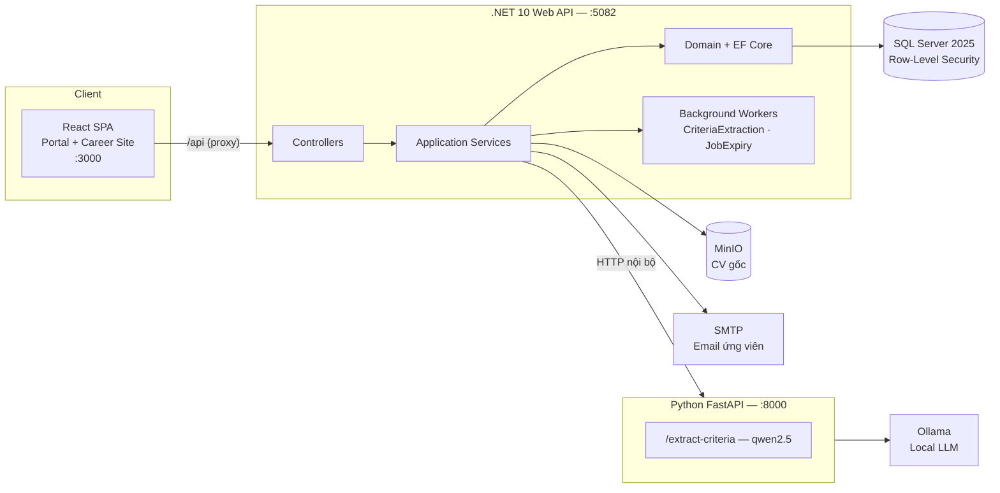
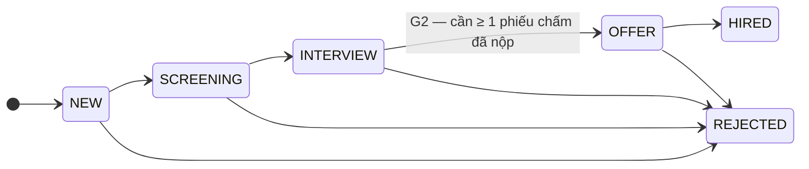

<div align="center">

# SRIS — Smart Recruitment and Interview System

**Hệ thống Tuyển dụng và Phỏng vấn Thông minh**

Nền tảng ATS (Applicant Tracking System) SaaS multi-tenant tích hợp AI cục bộ,
thiết kế riêng cho doanh nghiệp nhỏ (≤ 200 nhân sự) và công ty gia đình —
nhóm chưa có phòng nhân sự chuyên trách.

[](https://dotnet.microsoft.com/)
[](https://react.dev/)
[](https://fastapi.tiangolo.com/)
[](https://www.microsoft.com/sql-server)
[-000000)](https://ollama.com/)
[](#-giấy-phép)

</div>

---

## 📑 Mục lục

- [Giới thiệu](#-giới-thiệu)
- [Tính năng chính](#-tính-năng-chính)
- [Kiến trúc hệ thống](#-kiến-trúc-hệ-thống)
- [Công nghệ sử dụng](#-công-nghệ-sử-dụng)
- [Cấu trúc thư mục](#-cấu-trúc-thư-mục)
- [Bắt đầu nhanh](#-bắt-đầu-nhanh)
- [Cấu hình](#-cấu-hình)
- [Quy trình nghiệp vụ](#-quy-trình-nghiệp-vụ)
- [Bảo mật & Cô lập dữ liệu](#-bảo-mật--cô-lập-dữ-liệu)
- [Kiểm thử](#-kiểm-thử)
- [Tài liệu](#-tài-liệu)
- [Nhóm thực hiện](#-nhóm-thực-hiện)

---

## 🎯 Giới thiệu

Doanh nghiệp nhỏ tại Việt Nam thường tuyển dụng bằng Excel, Zalo và hộp thư Gmail:
CV nằm rải rác, không ai biết ứng viên đang ở bước nào, phỏng vấn xong không lưu lại điểm,
và CV bị loại ở đợt trước thì mất luôn. Các ATS quốc tế lại quá nặng và quá đắt cho quy mô này.

**SRIS** giải quyết bài toán đó với định vị: **"Quy trình tuyển dụng tối giản đúng chuẩn cho
công ty chưa có phòng HR."** Hệ thống không thêm quy trình mới — nó *cấu trúc hóa* đúng các bước
mà doanh nghiệp đang làm rời rạc, với AI đóng vai trợ lý thầm lặng thay vì ngôi sao.

**Triết lý thiết kế xuyên suốt: đơn giản là mặc định, phức tạp là tùy chọn.**
Công ty 10 người chỉ cần một tài khoản Admin để chạy trọn quy trình; công ty lớn hơn thì tách vai
bằng cách tạo thêm tài khoản — hệ thống lớn lên cùng doanh nghiệp.

Toàn bộ AI chạy **cục bộ (Local AI)**, không gửi dữ liệu ứng viên ra dịch vụ bên thứ ba —
phù hợp với Luật Bảo vệ dữ liệu cá nhân có hiệu lực từ 01/01/2026.

## ✨ Tính năng chính

| Module | Mô tả |
|---|---|
| **Career Site công khai** | Trang tuyển dụng riêng theo thương hiệu từng công ty (`/api/public/{slug}`), ứng viên nộp CV một trang, không cần tài khoản |
| **Pipeline Kanban** | Hồ sơ chạy qua 4 pha hiển thị, được bảo vệ bởi state machine 6 trạng thái / 8 transition ở tầng nội bộ (forward-only) |
| **AI đề xuất tiêu chí** | LLM cục bộ đọc JD → sinh danh sách tiêu chí **nháp** (tên + trọng số) → **người duyệt chốt**. AI không tự quyết tiêu chí. Bộ tiêu chí đã chốt trở thành phiếu chấm phỏng vấn |
| **Nhận & lưu hồ sơ** | Ứng viên nộp CV qua Career Site → bóc text từ PDF, lưu file gốc vào MinIO. Hệ thống **không** chấm điểm hay xếp hạng — sàng lọc là việc của người tuyển dụng |
| **Đặt lịch phỏng vấn kiểu Calendly** | Recruiter mở **một bộ khung giờ dùng chung** (gán panel interviewer) → mời hàng loạt → ứng viên tự chọn, ai chốt trước lấy trước → email xác nhận kèm file `.ics` |
| **Chấm phỏng vấn cộng tác** | Phiếu chấm theo đúng bộ tiêu chí đã chốt, tự lưu nháp; job có > 1 người chấm → **tự bật Blind Review**; nộp xong tổng hợp radar chart + gắn cờ tiêu chí bị lệch điểm nhiều |
| **Offer & phản hồi ứng viên** | Gửi offer → ứng viên bấm nhận/từ chối qua magic link → tự động chuyển HIRED / REJECTED |
| **Email tự động** | Trigger theo state machine, template động, mỗi công ty cấu hình SMTP riêng để mail đi từ tên miền của mình |
| **Dashboard & Analytics** | Phễu tuyển dụng, time-to-hire, tỷ lệ chấp nhận offer, phân tích lý do loại và nguồn ứng viên |
| **Multi-tenant** | Shared schema + `CompanyId`, cô lập bằng **Row-Level Security** ở tầng database |

## 🏗 Kiến trúc hệ thống



**Nguyên tắc kiến trúc**

- **Clean layering:** `Domain` không phụ thuộc `Application` hay hạ tầng; Web Host chỉ phụ thuộc `HostBase`.
- **.NET không gọi AI trực tiếp** — mọi tác vụ AI đi qua HTTP nội bộ tới Python service.
- **Python service stateless:** không chạm database, không biết tenant. Toàn bộ điều phối và ghi dữ liệu do .NET đảm nhiệm.
- **Bóc tiêu chí chạy nền:** bấm bóc tiêu chí chỉ xếp hàng rồi trả `202`; worker nền gọi AI và ghi kết quả, frontend hỏi trạng thái tới khi xong. LLM cục bộ mất hàng chục giây nên gọi đồng bộ sẽ bị timeout cắt ngang.

## 🛠 Công nghệ sử dụng

| Tầng | Công nghệ |
|---|---|
| **Backend** | ASP.NET Core 10 · EF Core 10 · AutoMapper · Serilog · Swashbuckle (Swagger) |
| **Frontend** | React 18 · Vite 8 · Ant Design 5 · TailwindCSS 4 · React Router 6 · Recharts |
| **AI Service** | Python · FastAPI · Ollama (`qwen2.5` bóc tiêu chí, JSON schema + `temperature=0`) |
| **Database** | SQL Server 2025 (compatibility level 170, Row-Level Security) |
| **Lưu trữ file** | MinIO (S3-compatible) — lưu CV gốc |
| **Migration** | DbUp — migration có version, kiểu Flyway, thuần .NET |
| **Kiểm thử** | xUnit (backend) · Vitest + Testing Library (frontend) |

## 📁 Cấu trúc thư mục

```
SRIS-Smart-Recruitment-and-Interview-System/
├── Development/
│   ├── backend/
│   │   ├── Hosts/GP35.SRIS/          # Web host: Controllers, Workers, cấu hình
│   │   ├── Src/
│   │   │   ├── Application/          # Business logic + Contracts (DTO, interface)
│   │   │   ├── Domain/               # Entities · Shared (enum, exception) · SqlServer (repo, UoW)
│   │   │   └── Library/              # Lib (email, HTTP client) · Cache · Storage · Storage.Minio
│   │   ├── Tests/                    # Unit test (xUnit)
│   │   ├── ai-service/               # Python FastAPI — bóc tiêu chí từ JD
│   │   ├── ai-experiments/           # Thí nghiệm đánh giá AI (KHÔNG chạy trong sản phẩm)
│   │   ├── tools/
│   │   │   ├── GP35.SRIS.DbMigrator/ # Migration DbUp (Scripts/V0xx__*.sql)
│   │   │   ├── run_minio.ps1         # Tải + chạy MinIO cục bộ
│   │   │   └── seed_demo.py          # Seed dữ liệu demo qua API thật
│   │   ├── db/                       # Script seed SQL phụ trợ
│   │   └── docs/                     # Tài liệu nghiệp vụ + API + sơ đồ PlantUML
│   └── frontend/                     # React SPA (Vite)
└── Document/                         # Tài liệu đồ án (business)
```

## 🚀 Bắt đầu nhanh

### Yêu cầu môi trường

| Thành phần | Phiên bản | Ghi chú |
|---|---|---|
| .NET SDK | 10.0+ | Bắt buộc |
| Node.js | 20+ | Bắt buộc |
| SQL Server | 2025 (compat 170) | Bắt buộc |
| Python | 3.10+ | Cho AI service |
| Ollama | mới nhất | `ollama pull qwen2.5` |
| MinIO | — | `tools/run_minio.ps1` tự tải về |

### 1. Clone & cấu hình

```bash
git clone <repository-url>
cd SRIS-Smart-Recruitment-and-Interview-System/Development/backend

# Tạo config local (file này đã được .gitignore, không ảnh hưởng team)
cp Hosts/GP35.SRIS/appsettings.Development.json.example Hosts/GP35.SRIS/appsettings.Development.json
# → sửa DefaultConnection trỏ tới SQL Server của bạn
```

### 2. Khởi tạo database

```bash
# Tự tạo database nếu chưa có, rồi chạy toàn bộ migration chưa áp dụng
dotnet run --project tools/GP35.SRIS.DbMigrator

# Xem các migration đang chờ
dotnet run --project tools/GP35.SRIS.DbMigrator -- list
```

### 3. Chạy các dịch vụ phụ trợ

```powershell
# MinIO — cổng 9000 (API) / 9001 (Console). Bucket 'sris-cv' tự tạo khi upload lần đầu.
./tools/run_minio.ps1
```

```bash
# AI Service — cổng 8000
cd ai-service
python -m venv .venv && .venv/Scripts/activate      # macOS/Linux: source .venv/bin/activate
pip install -r requirements.txt
uvicorn main:app --port 8000
```

### 4. Chạy Backend & Frontend

```bash
# Backend — http://localhost:5082 (Swagger tại /swagger)
dotnet restore && dotnet build
dotnet run --project Hosts/GP35.SRIS
```

```bash
# Frontend — http://localhost:3000 (proxy /api sang :5082)
cd ../frontend
npm install
npm run dev
```

### 5. (Tùy chọn) Seed dữ liệu demo

```bash
# Tạo user, job, bộ tiêu chí, ứng viên đủ mọi trạng thái pipeline, pool phỏng vấn, offer…
python tools/seed_demo.py <admin-email> <password>
```

<details>
<summary><b>Bảng cổng dịch vụ</b></summary>

| Dịch vụ | URL |
|---|---|
| Frontend | http://localhost:3000 |
| Backend API | http://localhost:5082 (Swagger: `/swagger`) |
| AI Service | http://127.0.0.1:8000 (`/health` để kiểm tra) |
| MinIO API / Console | http://127.0.0.1:9000 / http://127.0.0.1:9001 |

</details>

## ⚙️ Cấu hình

Cấu hình phân tầng: `appsettings.json` (giá trị dùng chung của team) được ghi đè bởi
`appsettings.Development.json` (riêng từng máy, đã `.gitignore`).

| Khóa | Mô tả |
|---|---|
| `ConnectionStrings:DefaultConnection` | Chuỗi kết nối SQL Server |
| `Auth:Key` / `Issuer` / `Audience` / `ExpirationMinutes` | Tham số ký JWT |
| `AiService:BaseUrl` | Địa chỉ Python AI service (mặc định `http://127.0.0.1:8000`) |
| `AiService:CriteriaMatchThreshold` | Ngưỡng similarity khi đối chiếu tiêu chí |
| `Storage:Minio:*` | Endpoint, khóa truy cập, bucket lưu CV |
| `Smtp:*` | Máy chủ gửi email mặc định (mỗi công ty có thể cấu hình SMTP riêng trong ứng dụng) |
| `CandidatePortal:BaseUrl` | Base URL dùng để dựng magic link gửi cho ứng viên |

> ⚠️ **Lưu ý bảo mật:** không commit chuỗi kết nối, khóa JWT hay mật khẩu SMTP thật.
> Khi triển khai, hãy đưa các giá trị này vào biến môi trường / secret manager.

## 🔄 Quy trình nghiệp vụ

### Bốn vai đăng nhập + một vai ẩn danh

> **Recruiter lái · Interviewer chấm · Department Manager quyết · Candidate ứng tuyển · Admin dựng sân**

| Vai | Trách nhiệm | Cách vào |
|---|---|---|
| **Admin** | Tạo tài khoản, gán vai, cấu hình công ty & thương hiệu | Đăng nhập (JWT) |
| **Recruiter** | Vận hành toàn bộ pipeline: đăng tin, sàng lọc, đặt lịch, gửi offer | Đăng nhập (JWT) |
| **Interviewer** | Chấm điểm phỏng vấn theo bộ tiêu chí | Đăng nhập (JWT) |
| **Department Manager** | Ra đề (Yêu cầu tuyển dụng) và chốt tuyển ở bước OFFER | Đăng nhập (JWT) |
| **Candidate** | Nộp CV, chọn lịch, xem trạng thái, trả lời offer | **Magic link** — không cần tài khoản |

### Pipeline: 6 trạng thái nội bộ, hiển thị 4 pha



Người dùng chỉ nhìn thấy **4 pha**: *Hồ sơ mới* · *Sàng lọc* · *Phỏng vấn* · *Quyết định*.
Sáu trạng thái là chuyện nội bộ. Pipeline **chỉ tiến, không lùi**; có thể loại ở bất kỳ pha nào.
Phỏng vấn nhiều vòng là **dữ liệu** (`InterviewSchedule.RoundNumber`) chứ không sinh thêm trạng thái.

### Trục tiêu chí — từ tin tuyển dụng tới phiếu chấm phỏng vấn

```
DM tạo Yêu cầu tuyển dụng (tùy chọn)
        ↓
Recruiter tạo Tin tuyển dụng
        ↓
AI bóc tiêu chí → DRAFT ──→ người duyệt chỉnh & chốt (APPROVED)
                                       ↓
                            Phiếu chấm phỏng vấn
                        (cả hội đồng chấm cùng bộ tiêu chí)
```

Mọi người phỏng vấn chấm trên **cùng một bộ tiêu chí**, thay vì mỗi người hỏi một kiểu rồi
so sánh bằng trí nhớ. Tiêu chí không do AI nghĩ ra — nó nằm sẵn trong tin tuyển dụng do người
có chuyên môn viết; AI chỉ bóc thành danh sách cho người duyệt.

## 🔐 Bảo mật & Cô lập dữ liệu

- **Row-Level Security tại tầng database** — mọi bảng đều có `CompanyId`; RLS được ép qua
  `SESSION_CONTEXT('CompanyId')`, thiết lập lại ở **đầu mỗi request** để tránh bẫy connection pooling.
- **JWT + RBAC** — `AuthMiddleware` dựng `IContextData` cho request; `[WithRole]` và
  `[WithPermission]` chặn ở middleware trước khi vào controller. Admin là superuser.
- **Magic link cho ứng viên** — ba mục đích (`SCHEDULE`, `STATUS`, `OFFER_RESPONSE`); token
  chỉ lưu **hash SHA-256**, không lưu bản gốc; có thời hạn và bị đốt khi hành động được chốt.
- **Blind Review** — điểm và ghi chú phỏng vấn ẩn hoàn toàn tới khi phiếu được `SUBMITTED`.
- **AI cục bộ** — dữ liệu ứng viên không rời hạ tầng của doanh nghiệp.
- **Phản hồi lỗi chuẩn hóa** — `{ errorCode, devMsg, userMsg, traceId, validationFailures }`,
  không rò rỉ chi tiết nội bộ ra client.

## 🧪 Kiểm thử

```bash
# Backend — xUnit
cd Development/backend
dotnet test

# Frontend — Vitest
cd Development/frontend
npm test
```

Phạm vi test hiện có: state machine chuyển trạng thái, mã hóa/giải mã magic link token,
xác thực & phân quyền, bóc/duyệt tiêu chí, phiếu chấm phỏng vấn.

## 📚 Tài liệu

| Tài liệu | Nội dung |
|---|---|
| [`Document/01_Business/SRIS_Business_Overview.md`](Document/01_Business/SRIS_Business_Overview.md) | **Tổng quan nghiệp vụ** — bối cảnh, persona, phạm vi, quy trình, KPI, rủi ro, kế hoạch |
| [`Document/01_Business/SRIS_WBS.md`](Document/01_Business/SRIS_WBS.md) | **WBS** — 104 gói công việc chi tiết kèm người phụ trách, ước lượng, sprint, minh chứng |
| [`Document/01_Business/HUONG_DAN_CHAY_BE.md`](Document/01_Business/HUONG_DAN_CHAY_BE.md) | Hướng dẫn chạy & test backend cho thành viên nhóm |
| [`docs/00_CONTEXT.md`](Development/backend/docs/00_CONTEXT.md) | **Single source of truth** — toàn bộ quyết định thiết kế, scope, nghiệp vụ |
| [`docs/NGHIEP_VU_TOM_TAT.md`](Development/backend/docs/NGHIEP_VU_TOM_TAT.md) | Tóm tắt nghiệp vụ, đọc trong 5 phút |
| [`docs/API_ENDPOINTS.md`](Development/backend/docs/API_ENDPOINTS.md) | Bản đồ toàn bộ endpoint kèm role — nguồn tham chiếu cho Frontend |
| [`docs/features/*.puml`](Development/backend/docs/features) | Sơ đồ lớp & sơ đồ tuần tự cho 12 tính năng (PlantUML) |
| [`ai-service/README.md`](Development/backend/ai-service/README.md) | Chi tiết AI service, model, endpoint |
| [`tools/GP35.SRIS.DbMigrator/README.md`](Development/backend/tools/GP35.SRIS.DbMigrator/README.md) | Quy ước migration & lệnh migrator |
| [`ai-experiments/README.md`](Development/backend/ai-experiments/README.md) | Phương pháp đánh giá AI: bộ test cố định, versioning prompt, đo hai tầng |

### Phương pháp đánh giá AI

Nhóm áp dụng khung **Prompt → Test → Đánh giá → Báo cáo**: bộ dữ liệu test cố định,
mỗi lần cải tiến chỉ đổi *một* yếu tố, đo hai tầng (chỉ số máy chấm + rubric người chấm).
Đã áp dụng lên tính năng AI đề xuất tiêu chí — **Precision 0.841 · Recall 0.914 · F1 0.876**
trên bộ 10 tin tuyển dụng đa ngành, không tiêu chí nào AI tự bịa. Số liệu, cách gán nhãn và
hạn chế của phép đo nằm đầy đủ trong `ai-experiments/`.

## 👥 Nhóm thực hiện

Đồ án tốt nghiệp — nhóm **GP35**, thực hiện 01/04/2026 – 31/08/2026.

| Thành viên | Vai trò | Phụ trách chính |
|---|---|---|
| **Vũ Gia Khánh** | BA/PM kiêm Backend Lead | Kiến trúc hệ thống, Auth & phân quyền, State Machine, magic link, AI service, đối chiếu theo tiêu chí, tài liệu |
| **San** | Backend — Nền tảng dữ liệu & Hạ tầng | CSDL & migration, Multi-tenant/RLS, lưu trữ tệp, xử lý PDF, pool khung giờ, triển khai |
| **Huy Minh** | Backend — Nghiệp vụ & Tích hợp | Job & Yêu cầu tuyển dụng, quản lý người dùng & phòng ban, email automation, Dashboard & Analytics |
| **Tùng Anh** | Frontend — Candidate Portal & Phỏng vấn | Career Site, form nộp CV, các trang magic link, phiếu chấm phỏng vấn |
| **Hùng Anh** | Frontend — Employer Portal & Trực quan hóa | Kanban, quản lý tin tuyển dụng, duyệt tiêu chí, dashboard biểu đồ, brand theming |

**Kế hoạch chi tiết:** [`Document/01_Business/SRIS_WBS.md`](Document/01_Business/SRIS_WBS.md) —
104 gói công việc, 1.230 giờ công, phân rã theo 5 giai đoạn / 10 sprint.

## 📄 Giấy phép

Dự án được phát triển cho mục đích học thuật (đồ án tốt nghiệp). Mọi quyền được bảo lưu.

<div align="center">
<sub>SRIS — Smart Recruitment and Interview System · GP35 · 2026</sub>
</div>
